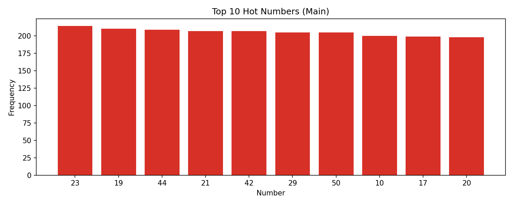
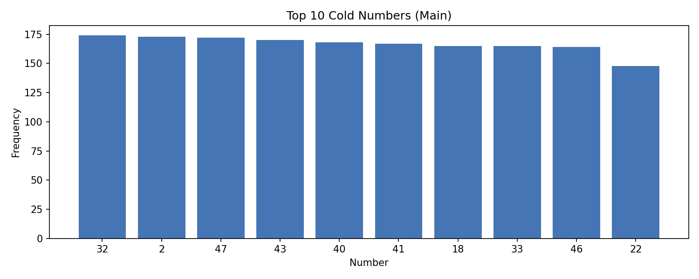
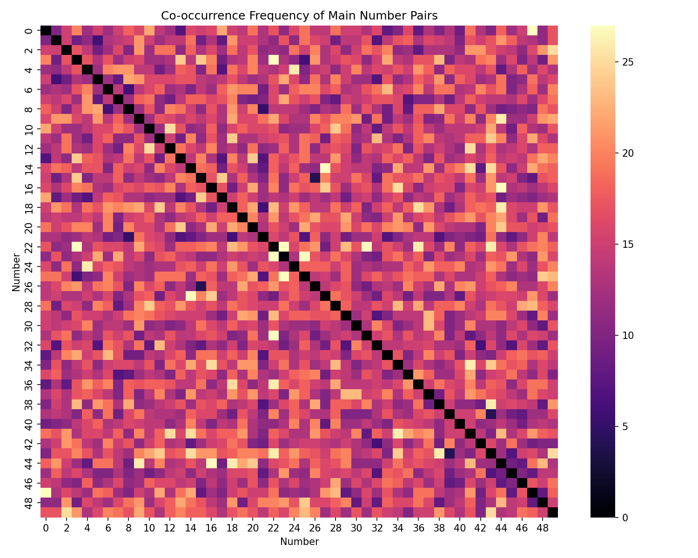
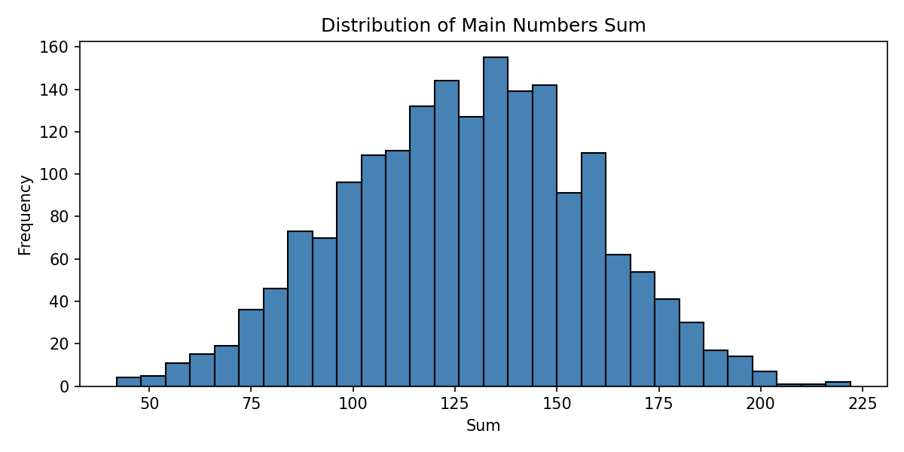
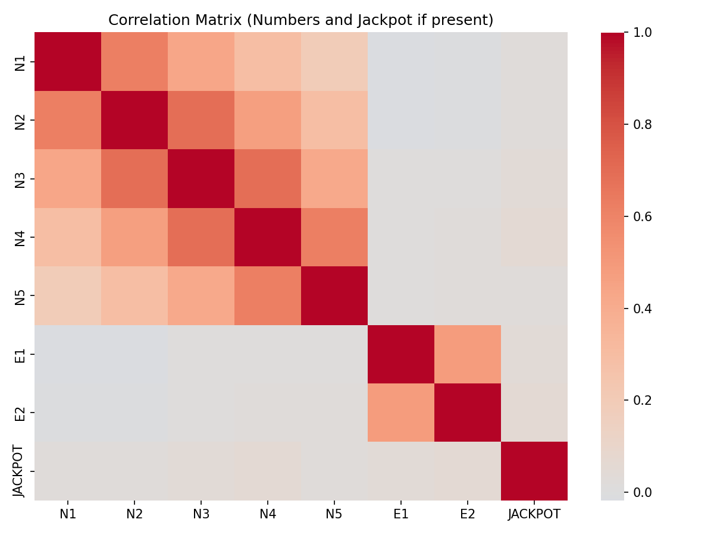
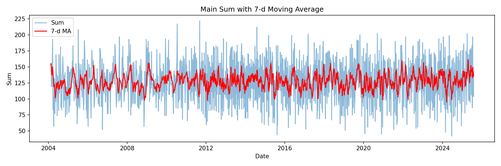
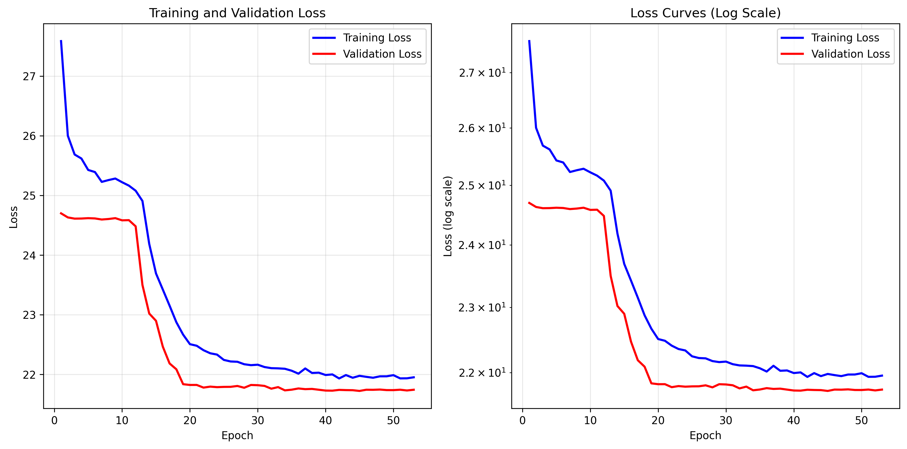

# EuroMillions Transformer

This project is an experiment in applying a Transformer-based deep learning model to predict EuroMillions lottery numbers. It involves a full pipeline from data cleaning and extensive statistical analysis to feature engineering, model training, and performance evaluation.

The primary goal was to explore the capabilities of sequence models on a dataset that is, by its nature, random. While the model did not achieve predictive success (as expected), the project serves as a comprehensive case study in data analysis, feature engineering, and applying deep learning to a time-series problem.

**Disclaimer:** This project is for educational and research purposes only. Lottery drawings are random events, and this model should **not** be used to make actual lottery predictions.

## Project Pipeline

The project is structured as a sequential pipeline, executed by the following scripts:

1.  **`clean-csv.py`**: This script takes the raw `euromillions.csv` file, cleans it, extracts the core columns (Date, Jackpot, Winning Numbers, and Stars), and saves the result to `euromillions_core_data.txt`.

2.  **`statistical-analysis.py`**: A deep dive into the historical data. This script performs over 25 different statistical analyses, generating visualizations to uncover patterns, frequencies, and relationships in the data. The resulting plots are saved in the `/plots` directory. Crucially, it also performs feature engineering and saves a processed dataset as `features_for_training.csv` for the model.

3.  **`train.py`**: This script trains the `LotteryTransformer` model on the `features_for_training.csv` dataset. It uses a validation set and early stopping to find the best model, which is then saved as `models/transformer/lottery_transformer_model_v4.pth`.

4.  **`inference.py`**: Loads the trained model to generate new, hypothetical lottery number predictions.

5.  **`compare.py`**: Evaluates the model's performance by comparing its predictions against the entire historical dataset, providing metrics on how often it matched the actual winning numbers. This serves as a reality check against a random baseline.

## Statistical Analysis Highlights

The `statistical-analysis.py` script generates numerous plots to visualize the dataset's characteristics. Here are a few key insights:

| Hot Numbers (Most Frequent) | Cold Numbers (Least Frequent) |
| :---: | :---: |
|  |  |

| Main Number Co-occurrence | Sum of Main Numbers |
| :---: | :---: |
|  |  |

| Correlation Matrix | Moving Average of Sums |
| :---: | :---: |
|  |  |

## Training Loss Curves

After training the Transformer model, the training and validation loss curves are automatically saved to the `plots/` directory. These visualizations help monitor the model's learning progress and identify potential overfitting or underfitting:

| Training Loss Curves |
| :---: |
|  |

The loss curves show both linear and log-scale views to better visualize the convergence behavior during training.


## How to Run

Follow these steps to set up the environment and run the entire pipeline from start to finish.

### 1. Prerequisites
*   Python 3.x
*   [uv](https://github.com/astral-sh/uv) - An extremely fast Python package installer and resolver.

### 2. Setup
First, clone the repository and set up a virtual environment using `uv`.

```bash
# Clone the repository
git clone <repository-url>
cd euromillions-transformer

# Create and activate a virtual environment with uv
uv venv
source .venv/bin/activate  # On Windows, use: .venv\Scripts\activate

# Install the required dependencies with uv
uv pip install -r requirements.txt
```

### 3. Download the Data
Download the EuroMillions results CSV from [loterieplus.com](https://www.loterieplus.com/euromillions/services/telechargement-resultat.php) and save it in the root of the project directory as `euromillions.csv`.

### 4. Execute the Pipeline
Run the scripts in the following order using `uv run`.

```bash
# 1. Clean the raw CSV data
uv run python clean-csv.py

# 2. Perform statistical analysis and generate features for training
uv run python statistical-analysis.py

# 3. Train the Transformer model
uv run python train.py

# 4. Generate new predictions with the trained model
uv run python inference.py

# 5. Compare model predictions against historical data
uv run python compare.py
```

## Data Source
The historical EuroMillions data was sourced from [loterieplus.com](https://www.loterieplus.com/euromillions/services/telechargement-resultat.php).